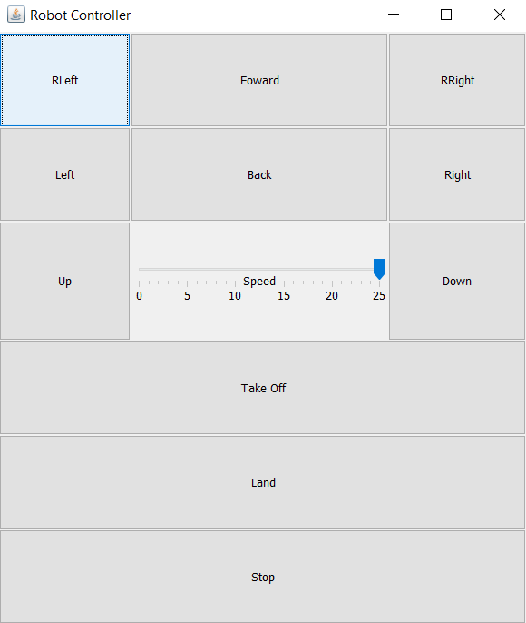

# Robot-Teleoperation
This is a simple java swing application that is able to teleoperate a drone via a web socket.
It does so by sending strings of json through the socket for which the server can read and execute the correct drone movement.

